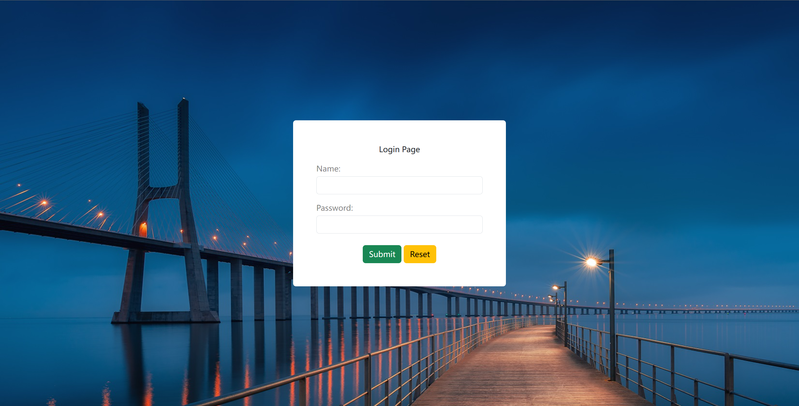
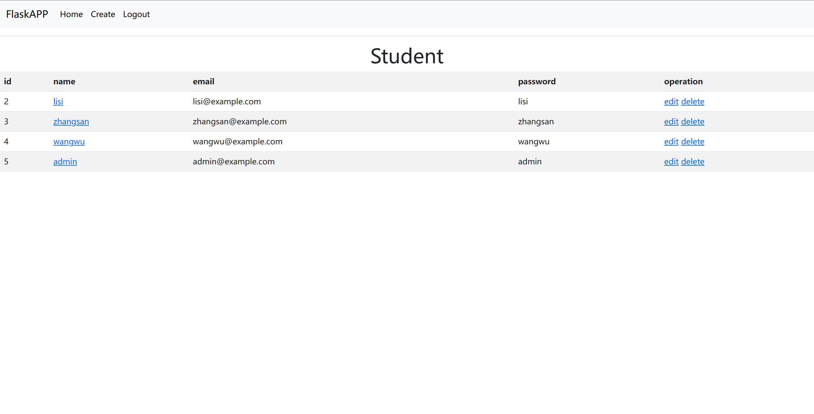
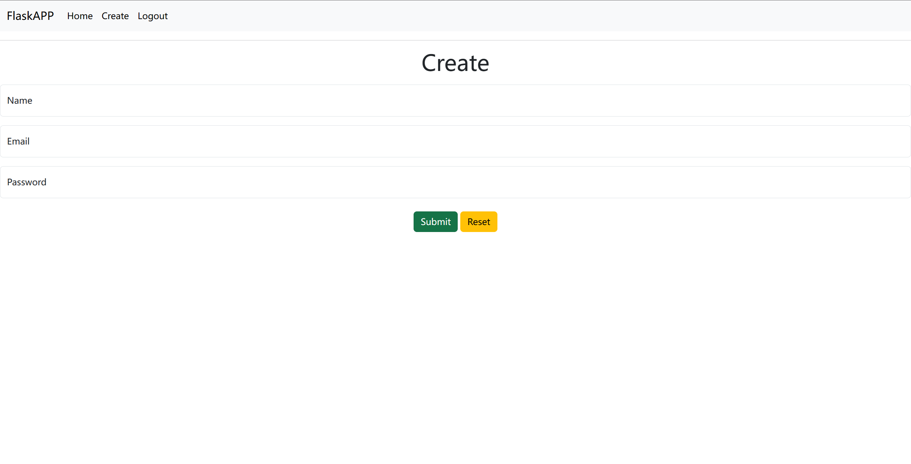
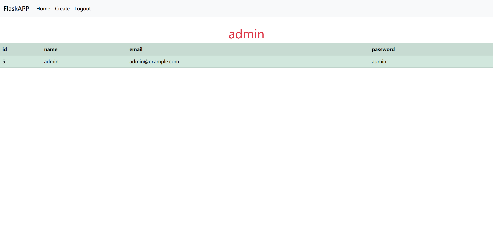

# Flask-student
    Support user information to add, delete, modify, login authentication, session persistence
  
# Requirement package
    Flask==2.3.2
    Flask-SQLAlchemy==3.0.3
    Jinja2==3.1.2
    SQLAlchemy==2.0.16
    Werkzeug==2.3.6
    
# Configuration  Virtual Environment
    apt install python3-venv
    python3 -m venv .\venv

# Project description
    Download the project to the virtual environment directory
    Install related dependency packages
    Run "flask run" or "python3 app.py" to run the project
  
# Test result

  

